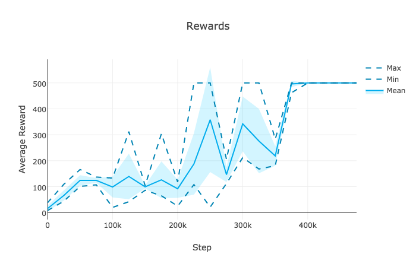

ACER
====
[](LICENSE.md)

Actor-critic with experience replay (ACER) [[1]](#references). Uses batch off-policy updates to improve stability. Trust region updates can be enabled with `--trust-region`. Currently uses full trust region instead of "efficient" trust region (see [issue #1](https://github.com/Kaixhin/ACER/issues/1)).

Run with `python main.py <options>`. To run asynchronous advantage actor-critic (A3C) [[2]](#references) (but with a Q-value head), use the `--on-policy` option.

Requirements
------------

- [OpenAI Gym](https://gym.openai.com/)
- [Plotly](https://plot.ly/python/)
- [PyTorch](http://pytorch.org/)

To install all dependencies with Anaconda run `conda env create -f environment.yml` and use `source activate acer` to activate the environment.

Results
-------



Acknowledgements
----------------

- [@ikostrikov](https://github.com/ikostrikov) for [pytorch-a3c](https://github.com/ikostrikov/pytorch-a3c)
- [@apaszke](https://github.com/apaszke) for [Reinforcement Learning (DQN) tutorial](http://pytorch.org/tutorials/intermediate/reinforcement_q_learning.html)
- [@pfnet](https://github.com/pfnet) for [ChainerRL](https://github.com/pfnet/chainerrl)

References
----------

[1] [Sample Efficient Actor-Critic with Experience Replay](https://arxiv.org/abs/1611.01224)  
[2] [Asynchronous Methods for Deep Reinforcement Learning](https://arxiv.org/abs/1602.01783)  

## Setup and Execution (Python 3.9 with Pyenv)

This project is intended to be run with Python 3.9.17. We recommend using `pyenv` to manage Python versions and `pyenv-virtualenv` for creating isolated environments.

### 1. Install Pyenv and Pyenv-Virtualenv
If you don't have `pyenv` and `pyenv-virtualenv` installed, please follow their official installation guides:
- `pyenv`: [https://github.com/pyenv/pyenv#installation](https://github.com/pyenv/pyenv#installation)
- `pyenv-virtualenv`: [https://github.com/pyenv/pyenv-virtualenv#installation](https://github.com/pyenv/pyenv-virtualenv#installation)

### 2. Install Python 3.9.17
Once `pyenv` is set up, install Python 3.9.17:
```bash
pyenv install 3.9.17
```

### 3. Create a Virtual Environment
Create a dedicated virtual environment for this project:
```bash
pyenv virtualenv 3.9.17 acer-env
```
This creates a virtual environment named `acer-env` using Python 3.9.17.

### 4. Activate the Environment and Install Dependencies
Activate the virtual environment:
```bash
pyenv activate acer-env
```
(Or, set a local pyenv version for the project directory: `pyenv local acer-env`)

Then, install the required packages using pip and the `requirements.txt` file:
```bash
pip install -r requirements.txt
```

### 5. Run the Agent
You can run the training script `main.py` with various arguments. For example, to train on CartPole-v1:
```bash
python main.py --env CartPole-v1 --name cartpole_test_run --T-max 100000 --num-processes 4
```
Refer to the arguments in `main.py` for more options:
```bash
python main.py --help
```
